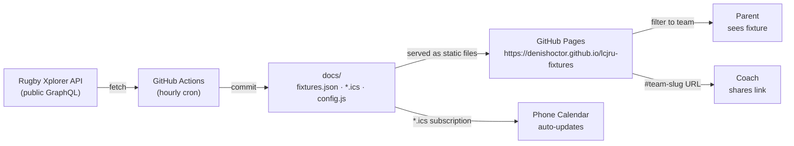
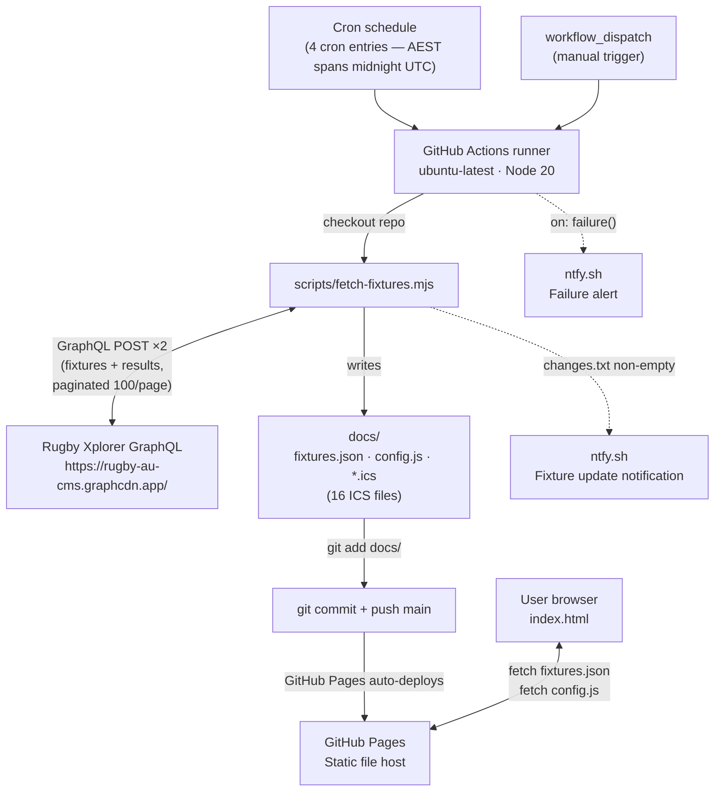
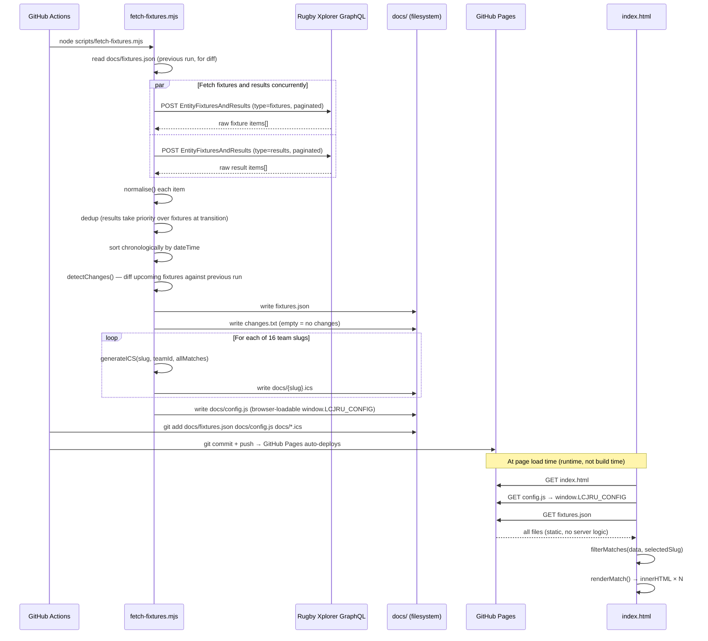
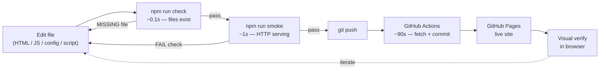

# LCJRU Fixtures — Architecture & Data Flow

A reference document for understanding how this system works, how data moves through it,
and how to develop against it effectively. Three zoom levels: system, component, field.

---

## 1. User-Centric View

### Who uses this and what they get

| Persona | Interaction | Value |
|---|---|---|
| **Parent** | Opens site on phone, filters to their child's team | Sees venue, time, and round for Saturday's game |
| **Coach / Manager** | Checks fixture details, shares team link | One URL per team (`#u7-gold`), sharable and bookmarkable |
| **Calendar subscriber** | Subscribes to team `.ics` feed once | Fixtures appear automatically in phone calendar, update without re-subscribing |
| **Admin (future-you)** | Updates config annually, monitors CI | One file to edit (`scripts/config.mjs`), one script to run |

### Value chain



---

## 2. System Overview

### Trigger conditions

| Trigger | When |
|---|---|
| Cron (weekdays) | Hourly 8am–6pm AEST Monday–Friday |
| Cron (weekends) | Hourly 5am–6pm AEST Saturday–Sunday |
| `workflow_dispatch` | Manual — any time via GitHub Actions UI |

### System-level flow



### What changes on each CI run

Every run writes (and conditionally commits) three output types:

| Output | File(s) | Committed if |
|---|---|---|
| Match data | `docs/fixtures.json` | Always (even if unchanged content, timestamp differs) |
| Browser config | `docs/config.js` | Always (regenerated each run) |
| Calendar feeds | `docs/*.ics` (16 files) | Always |
| Change log | `changes.txt` | Not committed — used only to trigger ntfy.sh |

`git diff --cached --quiet` suppresses the commit when all outputs are byte-for-byte identical.

---

## 3. Data Flow End-to-End

### Component-level sequence



### Key functions and their roles

| Function | File | Role |
|---|---|---|
| `fetchPage(type, skip)` | fetch-fixtures.mjs | Single paginated GraphQL request |
| `fetchAll(type)` | fetch-fixtures.mjs | Paginates until API returns < 100 items |
| `normalise(item)` | fetch-fixtures.mjs | Raw API item → clean match object (exported for unit tests) |
| `detectChanges(old, new)` | fetch-fixtures.mjs | Diffs upcoming fixtures for venue/time/added/removed |
| `generateICS(slug, ...)` | fetch-fixtures.mjs | Builds RFC 5545 VCALENDAR for one team |
| `buildDescription(match, ...)` | fetch-fixtures.mjs | ICS event body — includes sibling match for Minis |
| `icsFold(line)` | fetch-fixtures.mjs | RFC 5545 75-octet line folding (UTF-8 safe) |
| `displayLocation(rawVenue)` | fetch-fixtures.mjs | Strips pitch suffix, appends suburb — returns plain text (used for ICS and notifications) |
| `withRetry(fn, attempts)` | fetch-fixtures.mjs, fetch-lineups.mjs | Exponential-backoff retry wrapper (2s → 4s, 3 attempts) |
| `parseLineupData(pageProps)` | fetch-lineups.mjs | Extracts home/away players, coaches, officials from `__NEXT_DATA__` (exported for unit tests) |
| `parseVenue(rawVenue, venues)` | render.mjs | Returns `{ display, pitch, mapsUrl }` — `venues` passed explicitly so function is testable without browser |
| `shortTeamName(name)` | render.mjs | Removes "Lane Cove" prefix for display |
| `esc(str)` | render.mjs | HTML-escapes API strings before innerHTML |
| `scoreClass(match)` | render.mjs | Returns `'win'` / `'loss'` / `'draw'` / `''` for the LC team's result |
| `fmtDow/fmtDate/fmtTime(iso)` | render.mjs | Format ISO timestamps in AEST/AEDT using `Intl.DateTimeFormat` |
| `renderMatch(match, isNextUp)` | index.html | Produces HTML card for one match (uses imported helpers from render.mjs) |
| `renderLineupPanel(...)` | index.html | Builds the expandable team-sheet grid for a match |

**Minis sibling feature:** For U6–U9 ICS feeds, `generateICS()` looks up the sibling team
(e.g. U7 Gold's sibling is U7 Blue) and appends their same-day fixture to the ICS event
description — so parents see both teams' games in one calendar event.

---

## 4. Data Transformations

### Raw API → Normalised JSON → Rendered HTML

| Raw API field | Normalised (`fixtures.json`) | Rendered (browser) |
|---|---|---|
| `item.id` | `match.id` | `id="match-{id}"` — in-page anchor |
| `item.compName` | `match.competition` | Competition section header |
| `item.compId` | `match.compId` | Competition grouping key |
| `item.round` | `match.round` | `RND` badge label |
| `item.roundLabel \|\| item.round` | `match.roundLabel` | Display fallback |
| `item.dateTime` (ISO 8601 UTC) | `match.dateTime` (unchanged) | `Intl.DateTimeFormat('Australia/Sydney')` → `Sat 3 May · 10:00am` |
| `item.venue` (may include pitch suffix) | `match.venue` (unchanged) | `parseVenue()` strips pitch code → `{ display: "Name, Suburb", pitch: "TT1", mapsUrl }` → clickable pin link + pitch tag |
| `item.status` (`'Result'` or other) | `match.type` (`'result'` / `'fixture'`) | Badge colour: green (result+score), grey (result no score), blue (fixture) |
| `item.homeTeam.score` (`''` when unplayed) | `match.home.score` (`null` when `''`) | Score pill — hidden when `null` |
| `item.homeTeam.teamId` | `match.home.id` | Matched to `TEAM_SLUGS` → slug → URL hash `#u7-gold` |
| `item.homeTeam.name` | `match.home.name` | `shortTeamName()` removes "Lane Cove" prefix |
| `item.homeTeam.crest` (CDN URL) | `match.home.crest` | `` team badge |
| `item.isBye` | `match.isBye` | Bye badge |
| `item.isLive` | `match.isLive` | Live match indicator |
| `item.matchLabel \|\| null` | `match.matchLabel` | Finals label (e.g. "Grand Final") |

### Key transformation details

**Score normalisation**
```
API:  homeTeam.score = ''    (fixture, not yet played)
JSON: home.score = null      ('' → null via !== '' check, preserves score 0)
HTML: score pill hidden

API:  homeTeam.score = '0'   (played, zero score)
JSON: home.score = '0'       (not null — zero score preserved)
HTML: score pill shows '0'
```

**Venue cleaning**

Two separate paths depending on context:

*ICS / notification text* — `displayLocation()` in `fetch-fixtures.mjs`:
```
API:  "Tryon Oval TT1 (U6/U7)"
ICS:  displayLocation() → "Tryon Oval, East Lindfield"
      strips: / (?:TT|M)\d+\s*\([^)]+\)$/
      appends: VENUES["Tryon Oval"].suburb = "East Lindfield"
```

*Browser rendering* — `parseVenue()` in `docs/render.mjs` (imported by `index.html`):
```
API:   "Tryon Oval TT1 (U6/U7)"
HTML:  parseVenue() → {
         display:  "Tryon Oval, East Lindfield",
         pitch:    "TT1",
         mapsUrl:  "https://www.google.com/maps/search/..."
       }
       → <a class="venue-link" href="{mapsUrl}">📍 Tryon Oval, East Lindfield</a>  [TT1]
```

`VENUES` in `scripts/config.mjs` is the source for both suburb names and Maps URLs.
`docs/config.js` (generated) carries `VENUES` to the browser.

**Date/time formatting (DST-safe)**
```
JSON: "2026-05-02T00:00:00.000Z"   (UTC)
HTML: Intl.DateTimeFormat with timeZone:'Australia/Sydney'
      → "Sat 2 May · 10:00am"    (AEST, UTC+10)
      → "Sat 3 Oct · 10:00am"    (AEDT, UTC+11 — automatically correct)
```

**ICS-specific transforms**
```
dateTime → icsLocalDate()  → "20260502T100000"   (timed events, TZID=Australia/Sydney)
dateTime → icsDateOnly()   → "20260502"           (all-day events, DTEND = next day)
venue    → displayLocation() → icsEscape()        → RFC 5545 LOCATION
desc     → buildDescription() → icsEscape() → icsFold() → 75-octet folded lines
```

---

## 5. SDLC — Current State

### Development loop



**Pre-push hook** (requires one-time setup: `git config core.hooksPath .githooks`)
runs `npm run check && npm run smoke` automatically before every push.

### Friction map

| Change type | Edit → signal | Locally runnable | Agent-friendly |
|---|---|---|---|
| Config (`scripts/config.mjs`) | `npm run check` — ~0.1s | Yes | Yes |
| `normalise()` in fetch-fixtures.mjs | `npm run test:normalise` — ~0.1s | Yes | Yes |
| `parseLineupData()` in fetch-lineups.mjs | `npm run test:lineup` — ~0.1s | Yes | Yes |
| Other fetch script logic (ICS, pagination) | Requires live API to run | **No** | **No** |
| HTML structure / CSS | `npm run smoke` — ~1s (static file check) | Yes | Partial |
| render.mjs helpers (`esc`, `scoreClass`, etc.) | `npm run test:render` — ~0.2s | Yes | Yes |
| `renderMatch()`, `renderLineupPanel()` in HTML | Push → CI → Pages — ~90s | **No** | **No** |
| `tests/fixtures-json.test.mjs` | ~0.1s | Yes | Yes |
| `tests/api.test.mjs` | ~3s + network | No (needs network) | No |
| Full round-trip verification | ~2 min | No | No |

### What is tested locally (zero network)

| Test | Command | What it covers |
|---|---|---|
| Required files present | `npm run check` | `fixtures.json`, `lineups.json`, `config.js`, `render.mjs`, `index.html`, all 16 `.ics` |
| Files served over HTTP | `npm run smoke` | HTTP 200, `LCJRU_CONFIG` + `render.mjs` present, JSON has `matches[]`, ICS has `BEGIN:VCALENDAR` |
| JSON structure & fields | `npm run test:json` | Field completeness, sort order, score types, Lane Cove presence, no duplicates |
| ICS existence & format | `npm run test:ics` | All 16 files present, valid iCalendar wrapper, VEVENT fields |
| Normalise logic | `npm run test:normalise` | Score null/zero handling, type mapping, field passthrough |
| Lineup parse logic | `npm run test:lineup` | Player sorting, shirt vs position number, coaches, officials, empty states |
| Render helpers | `npm run test:render` | `esc` XSS encoding, `shortTeamName`, `isLaneCove`, `scoreClass`, `fmtDow/Date/Time`, `parseVenue` with pitch/mini patterns |

### What is NOT tested

| Gap | Impact |
|---|---|
| `renderMatch()`, `renderLineupPanel()` (still inline in HTML) | Changes to match card or lineup panel HTML are invisible to automated checks |
| `buildDescription()`, `icsFold()` with real matches | ICS content bugs only caught by subscribing a calendar client |
| Visual output in any browser | Pixel-level issues undetectable by automation |
| `fetchPage()` + pagination | Requires live API |

**Remaining agentic gap:** `smoke.mjs` fetches the raw HTML *source file* — before any
JavaScript executes. `renderMatch()` and `renderLineupPanel()` live in inline `<script>` tags
and run only in a browser. The pure helpers (`esc`, `scoreClass`, `parseVenue` etc.) are
now in `render.mjs` and fully testable; the HTML-generating functions are the remaining gap.

---

## 6. SDLC — Recommendations

### Done ✓

**Offline data pipeline testing:** `normalise()` is exported from `fetch-fixtures.mjs`;
`tests/normalise.test.mjs` covers score handling, type mapping, and field passthrough —
runs in ~100ms with no network. Similarly, `parseLineupData()` is exported from
`fetch-lineups.mjs` and covered by `tests/lineup.test.mjs` (15 cases, no network).

**Testable render functions:** Pure helpers extracted to `docs/render.mjs` (ES module).
Both HTML files switch to `<script type="module">` importing from it. `tests/render.test.mjs`
covers `esc`, `isLaneCove`, `shortTeamName`, `scoreClass`, `fmtDow/Date/Time`, `parseVenue` —
27 cases, runs in ~200ms with no network.

**Richer smoke assertions:** `smoke.mjs` now checks `fixtures.json` has 10+ matches and
contains a Lane Cove team; confirms `lineups.json` is valid JSON; verifies `render.mjs`
is served and exports `esc`.

### Remaining — extract `renderMatch` and `renderLineupPanel`

**Problem:** The two HTML-generating functions that combine all the pure helpers are still
inline in `index.html`. Changing their output structure is undetectable by automated checks.

**Fix (future):** Pass context explicitly and extract:

```js
// docs/render.mjs — future addition
export function renderMatch(match, ctx) {
  // ctx = { lineupsData, FINAL_ROUND, VENUES, PIN_SVG, CHEVRON_SVG }
  ...
}
export function renderLineupPanel(matchId, entry, homeName, awayName, homeCrest, awayCrest) {
  ...
}
```

Then `tests/render.test.mjs` can assert on the HTML fragment:

```js
test('renderMatch includes team-pill with short name', () => {
  const html = renderMatch(fixtureMatch, ctx);
  assert.ok(html.includes('Gold 12'));
});
```

Zero new dependencies. Makes the full rendering pipeline refactorable with confidence.

### Not recommended

| Approach | Why not |
|---|---|
| jsdom | Adds a dependency inconsistent with zero-dep philosophy |
| Playwright / Puppeteer | Heavy — ~200MB install, requires browser binary, slow startup |
| Visual regression testing | Overkill for a single-page static site with stable layout |

---

## 7. Key Files Reference

| File | Purpose | Reads | Writes | Tested by |
|---|---|---|---|---|
| `scripts/config.mjs` | Season/teams/venues — single source of truth. Exports `SEASON`, `TEAM_SLUGS`, `VENUES` (with `suburb` + `mapsUrl`), `MINIS_SLUGS`, `MINIS_SIBLINGS`, `FINAL_ROUND` | — | — | Imported by tests |
| `scripts/fetch-fixtures.mjs` | Fetch, normalise, diff, write all outputs | `config.mjs`, prev `fixtures.json` | `fixtures.json`, `config.js`, `*.ics`, `changes.txt` | `api.test.mjs` (live), `normalise.test.mjs` |
| `scripts/fetch-lineups.mjs` | Scrape lineup data from xplorer.rugby match pages | `fixtures.json`, `lineups.json` | `lineups.json` | `lineup.test.mjs` |
| `scripts/check.mjs` | Pre-flight: all required files present | `docs/*` (existence only) | — | Run by pre-push hook |
| `scripts/smoke.mjs` | Local HTTP server smoke test | `docs/*` (via HTTP) | — | Run by pre-push hook |
| `.github/workflows/refresh-fixtures.yml` | Cron CI: fetch → notify → commit → push | — | Triggers script; commits `docs/` | CI logs |
| `.github/workflows/resync-lineups.yml` | Cron CI: fetch lineups → commit if changed | — | Commits `docs/lineups.json` | CI logs |
| `docs/config.js` | Browser-loadable config (generated, do not edit) | Generated from `config.mjs` | — | `smoke.mjs` |
| `docs/fixtures.json` | All match data (generated, committed) | Written by fetch script | — | `fixtures-json.test.mjs`, `smoke.mjs` |
| `docs/lineups.json` | Per-match lineup data (generated, committed) | Written by lineups script | — | `smoke.mjs` |
| `docs/render.mjs` | Pure browser render helpers (ES module) — `esc`, `isLaneCove`, `shortTeamName`, `scoreClass`, `fmtDow/Date/Time`, `parseVenue` | — | — | `render.test.mjs`, `smoke.mjs` |
| `docs/index.html` | Production UI — `<script type="module">` importing `render.mjs` | `config.js`, `render.mjs`, `fixtures.json`, `lineups.json` at runtime | — | `smoke.mjs` (static only) |
| `docs/staging-index.html` | Staging UI — experimental features, not linked from main page | `config.js`, `render.mjs`, `fixtures.json`, `lineups.json` at runtime | — | Manual only |
| `docs/*.ics` | Per-team calendar feeds (16 files, generated) | Written by fetch script | — | `ics.test.mjs` |
| `tests/api.test.mjs` | Live API contract tests (requires network) | Rugby Xplorer API | — | Run manually / periodically |
| `tests/fixtures-json.test.mjs` | Committed JSON structure tests | `docs/fixtures.json` | — | `npm test` |
| `tests/ics.test.mjs` | ICS file structure and field tests | `docs/*.ics` | — | `npm test` |
| `tests/normalise.test.mjs` | Unit tests for `normalise()` | `scripts/fetch-fixtures.mjs` (import) | — | `npm test` |
| `tests/lineup.test.mjs` | Unit tests for `parseLineupData()` | `scripts/fetch-lineups.mjs` (import) | — | `npm test` |
| `tests/render.test.mjs` | Unit tests for all `render.mjs` exports | `docs/render.mjs` (import) | — | `npm test` |

---

## 8. Annual Update Checklist

Run this at the start of each new season (typically January–February).

1. **Update `SEASON`** in `scripts/config.mjs` (e.g. `'2026'` → `'2027'`)

2. **Check for new team IDs** — log in to [xplorer.rugby](https://xplorer.rugby), find each
   LCJRU team, and copy the team ID from the URL. IDs change when teams are re-registered.

3. **Update `TEAM_SLUGS`** in `scripts/config.mjs` with any new or changed IDs

4. **Review `MINIS_SLUGS` and `MINIS_SIBLINGS`** — add/remove age groups if the club's
   mini structure changes (e.g. adding U10 to Minis)

5. **Update `FINAL_ROUND`** if the competition length changes from 13 rounds

6. **Update `VENUES`** in `scripts/config.mjs` if new grounds are added — each entry needs
   a `suburb` string and a verified `mapsUrl` (Google Maps search URL for the ground)

7. **Run the fetch script** to regenerate all outputs:
   ```bash
   node scripts/fetch-fixtures.mjs
   ```

8. **Verify outputs locally:**
   ```bash
   npm run check    # all files present
   npm run smoke    # all files serve correctly
   node --test tests/fixtures-json.test.mjs   # JSON structure valid
   ```

9. **Commit and push:**
   ```bash
   git add scripts/config.mjs docs/
   git commit -m "chore: season YYYY setup — updated team IDs"
   git push
   ```

10. **Verify on GitHub:**
    - Actions tab: confirm the workflow runs green
    - Live site: confirm the new season's fixtures appear
    - Check one ICS file in a calendar client to confirm events load
